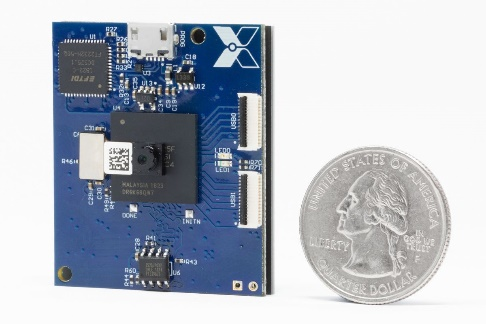

# Xnor.ai acquisition by Apple (\#3)

## Interesting news of the day

Apple have reportedly acquired [xnor.ai](https://xnor.ai) for [$200M](https://techcrunch.com/2020/01/15/apple-buys-edge-based-ai-startup-xnor-ai-for-a-reported-200m/) according to [geekwire](https://www.geekwire.com/2020/exclusive-apple-acquires-xnor-ai-edge-ai-spin-paul-allens-ai2-price-200m-range/).

The founders, Ali Farhadi and Mohammed Rastegari, invented the YOLO object detection network, and spun the company out from the Allen Institute for Artificial Intelligence (AI2) in 2017, raising $14.6 million in funding since then.

The company is well known for having advocated the use of binary neural networks rather than low-precision floating point, int8 or other numerical formats.

The advantage of (Binary Neural Networks) BNNs is that the chip area and propagation delays for circuits implementing BNNs are much less costly in dynamic and leakage power than NN accelerators using other formats.

The reason for this is down to Boolean algebra. The cost of a Binary multiplication is one AND gate. This contrasts with the O(n2) logic gates required to implement an nxn bit binary multiplier.

| A | B | A.B |
| - | - | --- |
| 0 | 0 | 0   |
| 0 | 1 | 0   |
| 1 | 0 | 0   |
| 1 | 1 | 1   |

Also the memory required to store a binary weight/coefficient for a BNN multiplier is one bit. And the wiring required to transmit the weight from a register or memory to the multiplier is one bit wide. In a nanometer world where wiring is now the most costly element of a System on Chip (SoC) this is a big deal.

## Why this is a big deal

Binary networks are not a new idea and in some ways are almost as old as computing itself

Alan Turing proposed the use evolution to “train” a particular type of neural network he called a “B-type unorganised machine” in 1948

The challenge until now has that while BNNs are very attractive from a power/area/cost/frequency perspective this big challenge was the degradation in network accuracy

As we all know network accuracy is key to being able to deploy a product or service based upon it as 50% accuracy means you might as well flip a coin as pay heed to the output of your deep network

The jury has been out on whether it is possible to trade off an increase in the complexity of BNN networks against higher accuracy

By that I mean recover the accuracy lost in simply quantising all the weights to 1-bit by making much wider and potentially much deeper networks

This has been the focus of a lot of academic effort and a few startups over the past 3-4 years

Clearly this must have yielded fruit for Apple to have paid $200M

## The devil is in the details

While on the face of it there's a potential 100x reduction in the size of the multipliers

if 8x8 bit multipliers are used. Equally the propagation delay is reduced by about one order of magnitude Finally the wiring related to individual weight is reduced by a factor of 8

The real catch is how many binary multipliers it takes to achieve the desired accuracy

Indeed the size of the multipliers is not the only factor to consider but each additional binary multiplier has to be wired to a 1 bit memory. You require more storage as you have a higher number of multipliers You trade off the higher amount of weight storage and smaller multipliers against a lower number of larger multipliers

So binary networks trade multiplier size off against increased weight storage and wiring to transmit the weights from memory to the 1-bit multipliers (AND gates)

In order to maximise the benefits of a 1-bit architecture one of the key factors would be the addressing overhead so Xnor must have invented some kind of patch-based scheme for grouping 1-bit weights so they would be fetched in 8/16/32-bit batches depending on the width of the memory used.

## Business advantage

Low cost, ultra low power inference for always-on features like wake on voice or wake on face are probably the key drivers for the acquisition by Apple and in fact they [pulled out of a deal with Wyze Cam](https://www.theverge.com/2019/11/27/20985527/wyze-person-detection-ai-startup-canceled-removed-dropped) in November 2019, Seattle based maker of security cameras a few months back likely as a result of the Apple deal.

The collapse of the Xnor deal has [apparently left owners of Wyze cameras without the people detection network](https://www.theverge.com/2020/1/15/21067594/apple-acquires-xnor-ai-wyze-camera-people-detection-feature) they had been using in their products.

Apparently Xnor’s business model was IP-enabled design services with several engineers being assigned to each project to perform the necessary integration and optimization work. Their main product offering was a [solar-powered AI inference camera](https://www.theverge.com/circuitbreaker/2019/2/15/18225972/tiny-solar-powered-ai-camera-xnor) running continuously on a Lattice FGPA which seems to have used the HiMAX low-power image sensor used by the [H2020 EoT project](https://en.wikipedia.org/wiki/Eyes_of_Things). The person detector ran at 32fps on a $2-FPGA (Lattice ECP5 dissipating on average 48mW (1.5mJ per inference).

This type of acquisition is not new to Apple with the company having previously having acquired custom dynamic logic startup [Intrinsity](https://www.anandtech.com/show/3665/apples-intrinsity-acquisition-winners-and-losers) in 2010 to bolster their SoC development teams for CPU and other high performance logic
